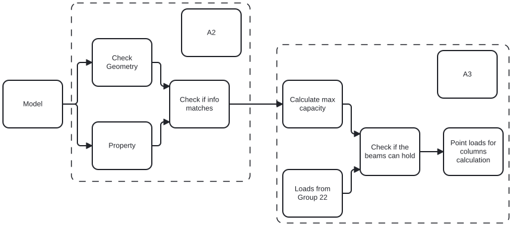

#A2a: About your group

Group consists of Mathias, Bastian and Johannes
We are all analysts and the main focus area for our group is Beams
We are all at level 3 "Agree" to being confident in python

#A2b: Identify Claim

We have selected building Building #2516. 
We would like to check the claim of the beam dimensions in the report and if they correlate to dimensions in the structural model. We will check for the dimension values created via. property sets in blender, and for the geometric values of the beams in the model. 

This will be the focus in this assignment
Later in the course the identified dimension will be used to calculate the strength of the beams. 

#A2c: Use Case
<!-- - How you would check this claim? -->
After located the dimension values for the beams in the IFC script, a check will be peformed in python to conclude if the dimensions in the property sets and geometric model are equal for each beam. 

<!-- - When would this claim need to be checked? -->
The check will be performed before calculating the structural strength to varify the dimensions are correct. 

<!-- - What information does this claim rely on? -->
The information rely on the geometric shape of the beams in the model, as well as the constructed property sets

<!-- - What phase? planning, design, build or operation. -->
In the design and evaluation phase. 

<!-- - What BIM purpose is required? Gather, generate, analyse, communicate or realise? -->
To analyse the structural model

<!-- Produce a BPMN-diagram for your chosen use case. Link to this so we can see it in your markdown file. To do this you will have to save it as an SVG, please also save the BPMN with it. You can use this online tool to create BPMN-diagrams
Your use case diagram should:

Describe all stages and processes of the use case
Shows the exchange of information between the stakeholders in the use case * Show the inputs and outputs between your tool and other data models, experts, stakeholders etc.
Clearly show the exchange of information between your tool and the IFC model. Which specific IFC classes are being checked or manipulated? -->

#A2d: Scope the use case

<!-- From the 'whole use case' identify where a new script / function / tool is needed. Highlight this in your BPMN diagram. Show this clearly in a new SVG diagram. You may wish to change the SVG diagram, you can use inkscape for this task. -->

#A2e: Tool Idea

<!-- Describe in words your idea for your own OpenBIM ifcOpenShell Tool in Python. -->

The tool takes the beam dimensions from the model, saves them in a dictionary with the global ID as key, and the width, height and length as values stored in a list. These dimensions are used to calculate the maximum uniform load with the assumption that the beams are simply supported. The end goal of the this, is to have another group provide the loads from the slabs supported by the beams and check if the capacity is sufficient. From there, we can pass on the loads continuing down the columns to another group whom will do the same type of calculations as us. 

<!-- What is the business and societal value of your tool? -->

With this tool, you can quickly and effectively check for beams in risk of not having sufficient capacity, and therefore save hours of work, and optimize the security of the building

#A2f: Information Requirements
<!-- Identify what information you need to extract from the model -->
Beam dimensions

<!-- Where is this in IFC? -->
The information is stored in two different ways. 
1.	Property sets: The ifc property sets include the dimensions of the beams
2.	Geometry: The nodes of the beams are stored as coordinates where you can calculate the dimensions manually.

<!-- Is it in the model? -->
Yes, in the model "25-16-D-STR" both the property sets and geometry are available. For some models, the property sets are not available which means you have to use the geometry.

<!-- Do you know how to get it in ifcOpenShell? -->
Yes, it is fetched with this method:
1.	Property sets: get.attr
2.	Geometr: ifcopenshell.geom

#A2g: Identify appropriate software licence
<!-- What software licence will you choose for your project? -->
Not sure what to answer